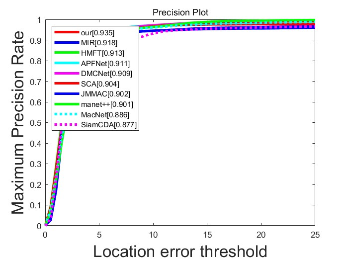
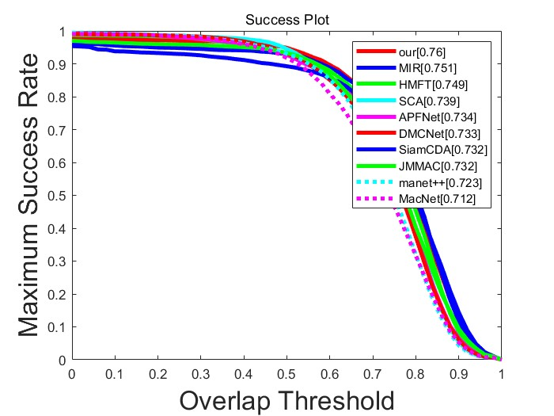
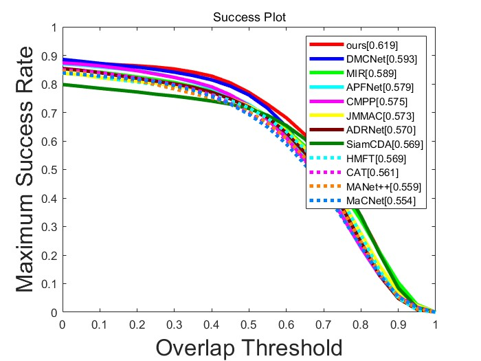
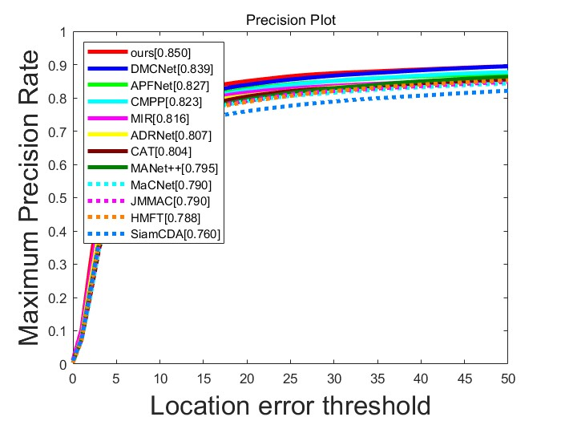
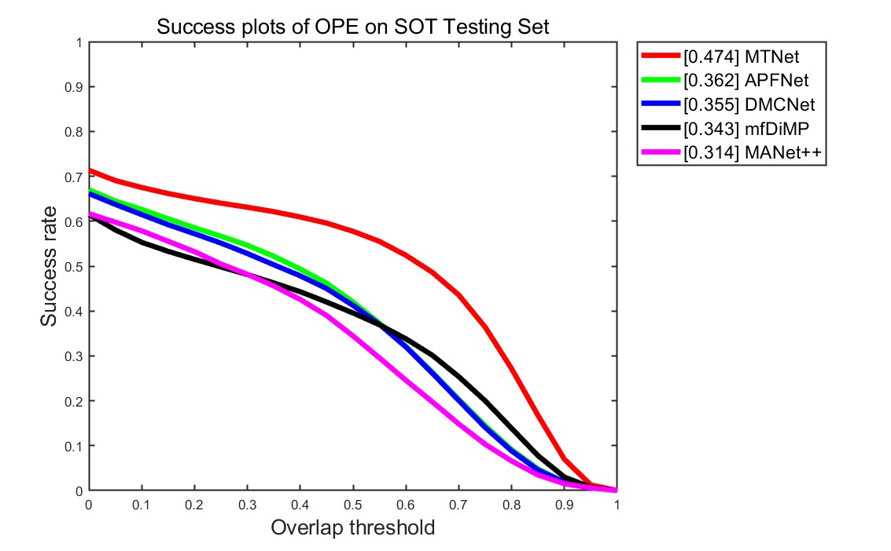

# ICME23-MTNet
This is the results of the ICME2023 paper "MTNet: Learning Modality-aware Representation with Transformer for RGBT Tracking".

## GTOT results
 
## RGBT-234 results


## LaSheR results



## Citation
Please cite this paper in your publications if it helps your research:
```
Ruichao Hou, Boyue Xu, Tongwei Ren, Gangshan Wu. Proceedings of IEEE International Conference on Multimedia and Expo (ICME'23), Brisbane, Australia, 2023.
```
