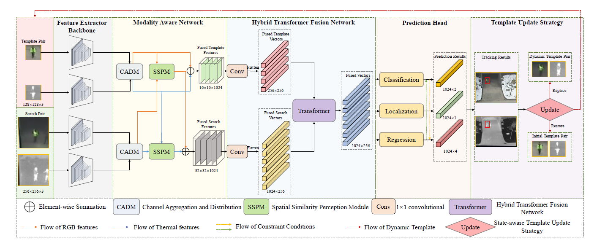

# ICME23-MTNet
This is the results of the ICME2023 paper "MTNet: Learning Modality-aware Representation with Transformer for RGBT Tracking".

## GTOT results

## RGBT-234 results

## LaSheR results

