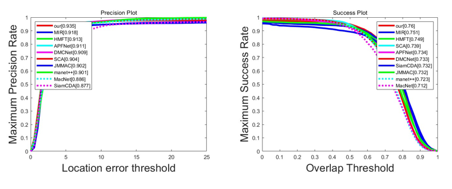
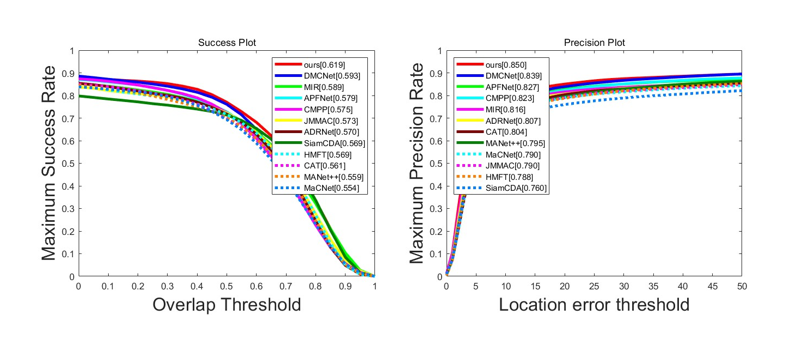
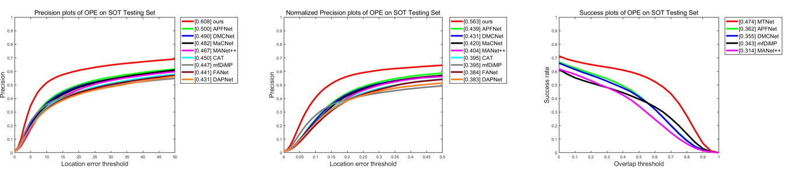

# ICME23-MTNet
This is the results of the ICME2023 paper "MTNet: Learning Modality-aware Representation with Transformer for RGBT Tracking".

## 🌟GTOT results
You can download the raw result GTOT-result.rar

**GTOT PR:0.935 SR:0.760**
 
## 🌟RGBT-234 results
You can download the raw result RGBT234-result.rar

**RGBT234 PR:0.850 SR:0.619**

## 🌟LaSheR results
You can download the raw result LaSHeR-result.rar

**LasHeR PR:0.608 NPR:563 SR:0.474**

## Citation
Please cite this paper in your publications if it helps your research:

```
[1] Ruichao Hou, Boyue Xu, Tongwei Ren, Gangshan Wu. Proceedings of IEEE International Conference on Multimedia and Expo (ICME'23), Brisbane, Australia, 2023.

[2] Hou, Ruichao, Tongwei Ren, and Gangshan Wu. "MIRNet: A Robust RGBT Tracking Jointly with Multi-Modal Interaction and Refinement." 2022 IEEE International Conference on Multimedia and Expo (ICME). IEEE, 2022.
```
